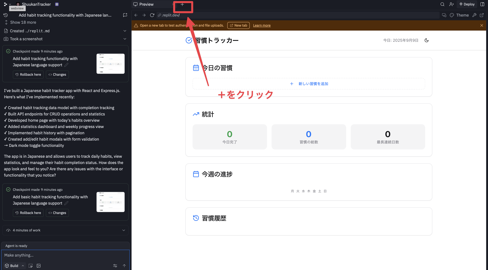
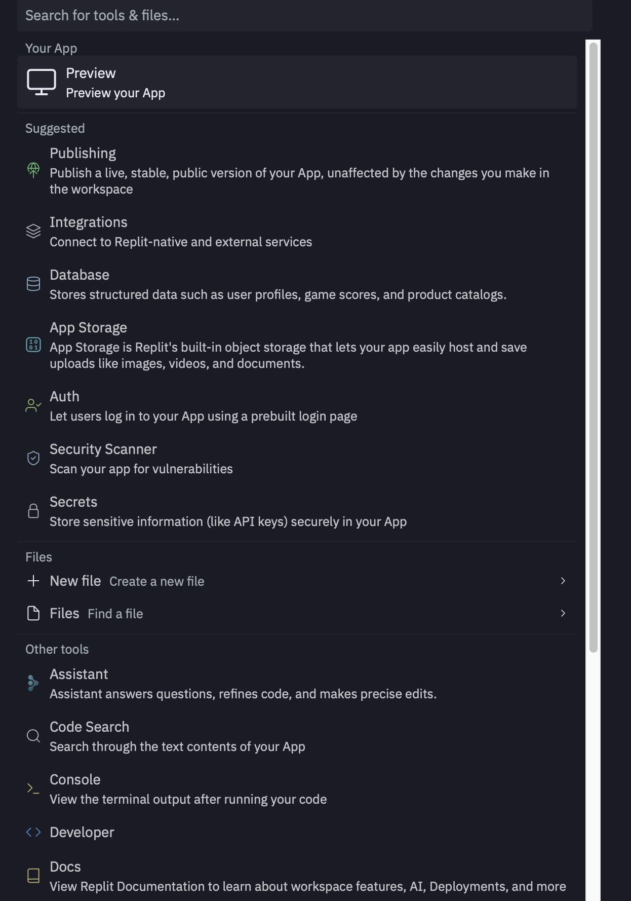

# 第 2 章: Replit でアプリを作ろう - プロンプト集

## 2-2-1 最初の計算機アプリ開発

### 基本的な計算機アプリ

```
高品質なデザインの四則計算機を作ってください。
```

### 動作確認の報告

```
正しく動作します。
```

### 機能拡張：履歴機能の追加

```
履歴機能を追加してください
```

## 2-3-4 Replit の各種ツール紹介

### プレビュータブの新規作成

Replitのワークスペースには、開発をサポートする様々なツールが用意されています。プレビュー機能もその一つで、「+」ボタンから新しいタブでプレビューを開くことができます。

#### 手順

1. 画面右上の「+」ボタンをクリックしてください
2. 新しいタブでプレビューが開きます



この変更により、プレビューとコードエディタを独立したタブで管理できるようになり、より効率的な開発環境を提供しています。

#### 追加のスクリーンショット


