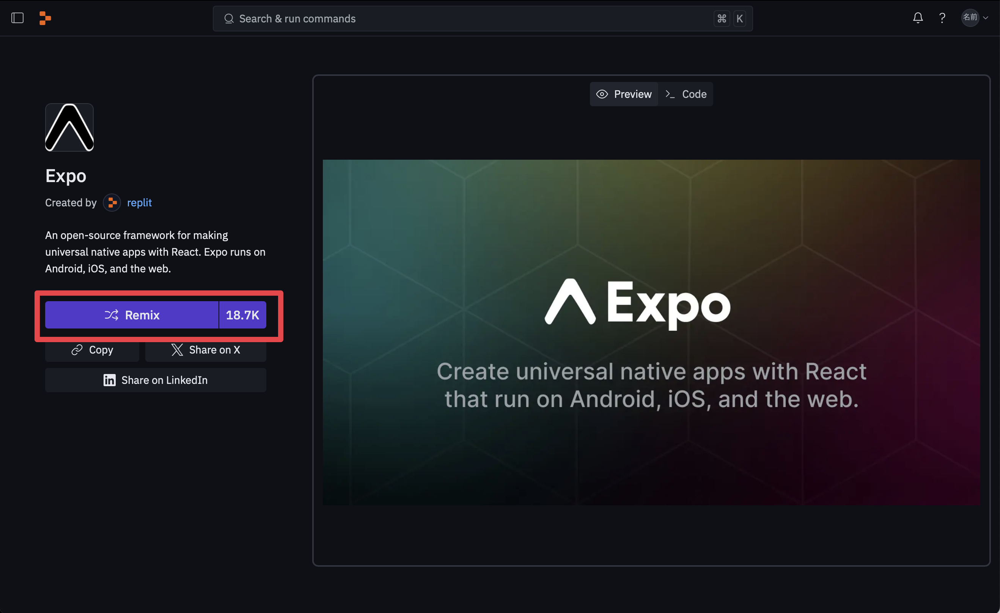
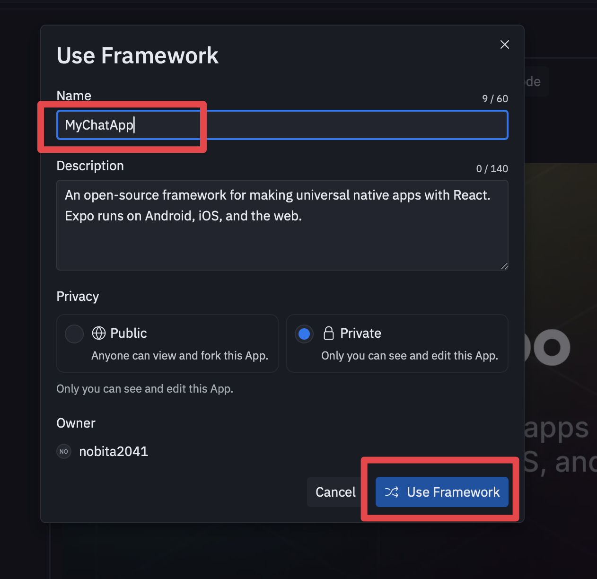

# 第8章: Replitの未来とこれからの学習

本章では書籍で紹介されている内容に関連するプロンプトを提供します。

## 📱 8-1 スマートフォンからの開発

書籍では、Replitアプリを使ったスマートフォンでの開発について解説されています。

## 📱 8-2 ネイティブアプリ作成

### 📝 書籍発売後のアップデート情報

**Expoテンプレートの利用方法が変更されました**

書籍で解説されている手順から変更があり、現在は以下の手順でExpoプロジェクトを作成できます：

1. 以下のURLにアクセス
   ```
   https://replit.com/@replit/Expo
   ```

2. 画面右上の「Remix」ボタンをクリック



3. 「Use Framework」ダイアログが表示されるので、以下を設定：
   - **Name**: プロジェクト名を入力（例：MyChatApp）
   - **Description**: プロジェクトの説明（自動入力されます）
   - **Privacy**: Private（プライベート）を選択（推奨）
   - **Owner**: 自分のアカウントが表示されます



4. 「Use Framework」ボタンをクリックしてプロジェクトを作成

### AIチャットボットアプリの作成プロンプト

書籍8-2節で解説されているAIチャットボットアプリの作成に使用できるプロンプトです。

```
OpenAIを利用したAIチャットボットを作成してください
```

このプロンプトをReplitのAssistantに入力することで、書籍で解説されているようなAIチャットボットアプリを作成できます。


## 📚 8-4 継続的な学習リソース

書籍で紹介されている学習リソース：

- **公式ドキュメント**: https://docs.replit.com
- **公式YouTubeチャンネル**: https://www.youtube.com/@replit
- **コミュニティフォーラム**: https://forum.replit.com
- **筆者運営サイト**: https://note.com/nobita2041
